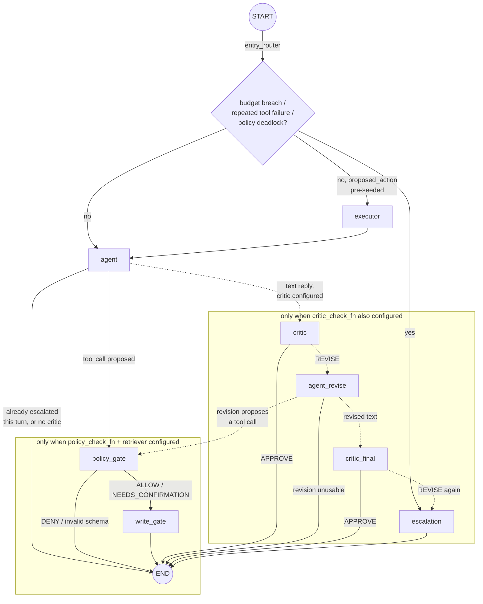

# Architecture

## The graph

`src/guarded_agent/graph.py` builds a LangGraph `StateGraph[AgentState]`. The diagram
below is the graph as actually compiled when every guardrail is enabled (`build_graph`'s
"full" wiring — the same shape `GuardedTau2Agent`'s default factory uses). Dashed nodes
and edges only exist when the corresponding optional dependency is passed to
`build_graph` (`policy_check_fn`+`retriever` for the whole `policy_gate`/`write_gate`/
`critic`/`agent_revise`/`critic_final` branch, `critic_check_fn` specifically for the
critic sub-branch) — the `baseline` ablation variant, for example, compiles with none of
the dashed nodes at all, verified live by inspecting `agent.app.get_graph().nodes` for
each of the five ablation variants (see `PLAN.md` commit 23).

The topology is deliberately **acyclic through the critic loop**: `critic` and
`critic_final` are the same underlying node function (`make_critic_node`'s closure),
added to the graph under two different names with two different routers. Nothing routes
back into `agent_revise` a second time — the one-bounded-revision guarantee (PLAN.md
commit 20's "the critic loop is the classic place agents hang" risk) comes from the
graph's *shape*, not a counter that could be forgotten to check.

## Node responsibilities

| Node | Reads | Does | Writes |
|---|---|---|---|
| `agent` | `conversation` | Calls `generate_fn` (the real LLM call). An empty decision (neither text nor a tool call) escalates immediately rather than sending nothing. | `proposed_action` or a new assistant message; `escalated`/`escalation_reason` on the empty-decision path |
| `executor` | `proposed_action` | Dispatches a **pre-seeded** action through the tool registry. Only reachable when something pre-seeds `proposed_action` before the graph runs — never in the live tau2-driven path, since tau2 executes tools externally and returns results as the *next* turn's input. Idempotent per `(session_id, turn, action_hash)` via `DispatchCache`. | A tool-result message, `budget.tool_calls_used` |
| `policy_gate` | `proposed_action` | Schema-validates the action (via the registry's own JSON-schema validator, in "don't actually call the handler" mode), then checks it against retrieved policy clauses (`PolicyCheckFn`). DENY or invalid schema pops the still-unexecuted proposal and replaces it with an explanation. | `policy_verdict`, `consecutive_policy_denials`, conversation |
| `write_gate` | `proposed_action`, `policy_verdict`, `pending_confirmation` | Gates mutating actions (or any `NEEDS_CONFIRMATION` verdict, regardless of the tool's own mutating flag) behind an explicit "yes." Matches a re-proposed action to a pending one by *content hash*, not id, since the LLM assigns a fresh `tool_call.id` every turn even for the same call. | `pending_confirmation`, conversation |
| `critic` / `critic_final` | Last message (the drafted text reply) | Reviews the draft for unsupported claims and policy drift against retrieved context. APPROVE is a no-op. REVISE pops the draft (the user never saw it) and records the reason in `critic_feedback`. | `critic_feedback`, conversation |
| `agent_revise` | `conversation`, `critic_feedback` | The one allowed regeneration, with the critic's feedback appended as a one-off note (never persisted into `conversation` itself). A tool call from the revision is treated as a legitimate outcome — routed through `policy_gate` like any other proposal, not penalized (a live-verified fix: an earlier version escalated on any tool call here, which tanked a real smoke run's Pass^1 by punishing ordinary "let me check that" recoveries). Only a revision with neither text nor a tool call escalates. | `proposed_action` or a new assistant message, `critic_feedback` always cleared |
| `escalation` | `budget`, `conversation`, `consecutive_policy_denials`, `critic_feedback` | Terminal. Recomputes *which* of the four triggers fired to report an accurate reason, since the router only decided *that* escalation was needed. Proposes a real `transfer_to_human_agents` tool call if the domain registers one; otherwise a plain hand-off message. | `escalated`, `escalation_reason`, conversation, `critic_feedback` cleared |

## State schema (`src/guarded_agent/state.py`)

`AgentState` is the single pydantic model every node reads and returns an update for —
LangGraph nodes are pure functions of state in, dict-of-updates out (`return
{"conversation": ..., "proposed_action": ...}`, never a full new object), which is what
makes `run()`'s `AgentState.model_validate(app.invoke(state))` normalization necessary:
untouched Optional fields silently disappear from the returned dict rather than coming
back as explicit `None`.

- **`conversation: list[Message]`** — the only field every node reads. `Message.error`
  mirrors tau2's own per-tool-result error flag (propagated by the adapter), which is
  what `guardrails/escalation.py`'s repeated-tool-failure check reads — derived fresh
  from history every time, not a second mutable counter that could drift out of sync
  with the messages that justify it.
- **`proposed_action` / `policy_verdict` / `pending_confirmation` / `critic_feedback`** —
  all transient, per-turn coordination fields with the same lifecycle: set by one node,
  consumed and cleared by a later one in the *same* turn, never meant to survive into a
  future conversation turn. The adapter (`adapters/tau2_agent.py`) explicitly clears
  `proposed_action` after translating it into the outgoing tau2 message, for the same
  reason `agent_revise` always clears `critic_feedback` — leaving either set would
  misroute the *next* turn.
- **`consecutive_policy_denials: int`** — the one exception to "derive it fresh from
  history": incremented by `policy_gate` on DENY, reset on any other verdict. Tool
  failures use history-derivation instead specifically because `Message.error` already
  carries what's needed; policy denials don't have an equivalent flag on `Message`, so a
  counter is the simpler pure option here.
- **`budget: BudgetCounters`** — steps/tool-calls/tokens/elapsed-seconds. `elapsed_seconds`
  is *set*, not incremented, each turn by the adapter (the one place that's allowed to
  read a clock) — `BudgetCounters` itself never does.
- **`escalated` / `escalation_reason`** — set once, by whichever escalation trigger fires
  first; nothing un-escalates a state within a turn.

## Tool registry (`src/guarded_agent/tools/registry.py`)

Two construction paths for the same `ToolRegistry`/`ToolDefinition` shape:
`ToolRegistry.load()` reads a static `registry.yaml` (hand-authored `mutating`/
`risk_tier` per tool, used by tests and any non-tau2-driven caller); `from_openai_schemas`
builds one dynamically from a live tau2 domain's OpenAI-style tool schemas, with real
per-tool mutating classification (`mutating_by_name`) extracted from tau2's own
`@is_tool(ToolType.WRITE)` decorator via `adapters/tau2_agent.py`'s
`_extract_mutating_by_name` — reading tau2's private `Tool._func.__mutates_state__`
attribute, stable only because the dependency is pinned to an exact tag. A tool name not
present in `mutating_by_name` defaults to `mutating=True` — fail-safe forcing, the same
principle CLAUDE.md applies to every degraded-input case in this codebase.

`dispatch(tool_name, arguments, handler)` validates `arguments` against the tool's own
JSON Schema (`jsonschema.Draft202012Validator`) before ever calling `handler`, and never
raises: an unknown tool or a schema violation comes back as a structured
`ToolResult(ok=False, error=ToolError(...))`, not a retry that hides the problem and not
an exception that would crash the node. `policy_gate` reuses this same validator in a
validation-only mode (`handler = lambda _args: None`) to check schema compliance before
anything is ever actually dispatched.

## The four escalation triggers

PLAN.md commit 18 shipped three; commit 20 added a fourth when the critic landed. All
four converge on the same `escalation` node and the same two possible outputs (a real
`transfer_to_human_agents` proposal, or a plain-text hand-off).

1. **Budget breach** (`guardrails/budgets.py`'s `check_budget`) — steps, tool calls,
   tokens, or wall-clock time over a configured cap.
2. **Repeated tool failure** (`guardrails/escalation.py`'s
   `count_consecutive_tool_failures`) — N consecutive failed tool results, derived fresh
   from conversation history each check; a tool-call-proposal message with no text
   doesn't break the streak (it's the "asking" half of a result already counted or about
   to be), only a successful result, a text reply, or a user message does.
3. **Policy deadlock** (`check_policy_deadlock`) — N consecutive `DENY` verdicts from
   `policy_gate`, tracked via `AgentState.consecutive_policy_denials`.
4. **Critic double-rejection** — `critic_final` (the second, bounded pass) still
   returning REVISE. Structurally distinct from the first three: it's the only trigger
   the `escalation` node can't detect just from `budget`/`conversation` alone, which is
   why it reads `state.critic_feedback` directly to build an accurate reason string.

Triggers 1–3 are checked by `entry_router` at the *start* of a turn, before `agent` ever
runs — a breach detected then means the LLM is never called at all this turn. Trigger 4
is only reachable *from inside* a turn already in progress (after a first critic
rejection and one revision), and its route to `escalation` deliberately bypasses
`policy_gate`/`write_gate` entirely: routing a policy-deadlock-driven escalation back
through the policy gate risks another denial, defeating the point of escalating.

## Pure vs. impure modules

CLAUDE.md holds `guardrails/`, the tool registry's schema validation, and
escalation-trigger logic to a harder standard than the rest of the codebase: zero I/O —
no network call, no clock read, no LLM call. Verified against the actual imports in each
file, not just described:

| Pure (zero I/O, unit-tested without mocks) | Impure (LLM / embedding model / network / clock) |
|---|---|
| `guardrails/budgets.py` | `guardrails/policy_checker.py` (`litellm.completion`) |
| `guardrails/write_gate.py` (hashing, regex confirmation matching — `DispatchCache` holds state but performs no I/O itself) | `guardrails/critic.py` (`litellm.completion`) |
| `guardrails/escalation.py` | `guardrails/policy_retrieval.py` (HuggingFace embedding model, FAISS) |
| `tools/registry.py`'s `dispatch` validation path (the caller-supplied `handler` it invokes may itself be impure — that's the caller's concern, not the registry's) | `memory/case_store.py` (embedding model, FAISS) |
| `state.py` (plain data + pure transformations) | `adapters/tau2_agent.py` (glues everything together; calls `litellm`/`tau2` directly) |
| `memory/session.py`'s `build_case_record` (derives a summary from already-in-hand state) | `telemetry/tracing.py` (OpenTelemetry export) |
| `analysis/mast_labeler.py`'s four deterministic checks | `analysis/mast_labeler.py`'s `make_llm_judge_fn` (the *other* half of the same module — deterministic-first, LLM-only-for-the-residual is itself a pure/impure split within one file) |
| `analysis/trace_loader.py` (pure parsing of an already-read file) | `evals/run_suite.py`, `evals/adversarial/runner.py` (drive real, live graph runs) |

`memory/retention.py`'s `redact_pii` is pure regex, called by `memory/session.py`
before any free-text field is allowed into a `CaseRecord` — the PII-redaction guarantee
depends specifically on this being deterministic and side-effect-free.
